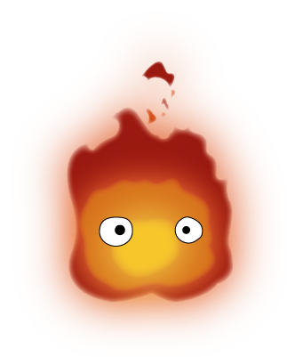

# Calcifer

A side-project to build somewhat of a home automation tool, not pretending to be production-ready in any way. Might burn things or power moving castles.

## Warning
Calcifer is and always will be a testing ground for me to play with things.

This means that, sometimes, how things are made or done will intentionaly not a _best practice_ or _the best option_.

If you'd like to know the reasoning behind something that raises your eyebrows, please, open an issue and ask :smile:

## Usage

## License

MIT

## Acknowledgements

* [Cute calcifer image](https://www.pinterest.es/pin/725501821195734857)
